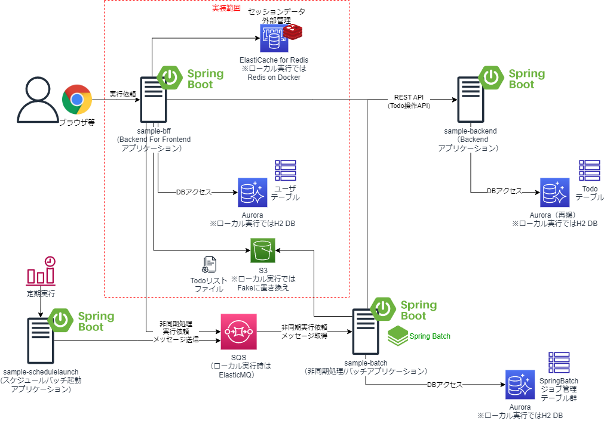
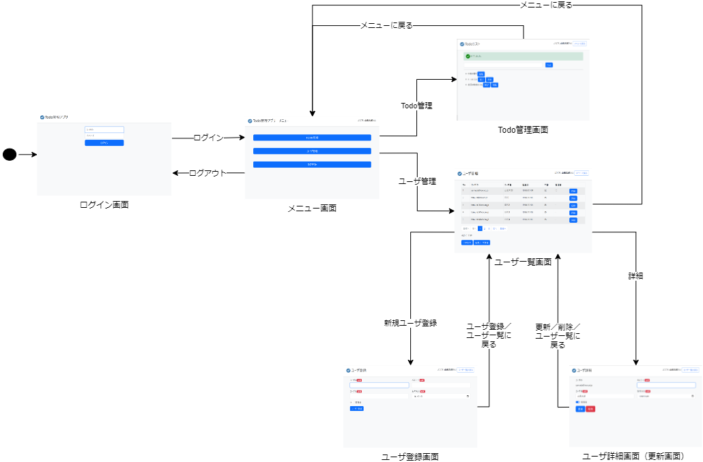

# SpringBootのBackend For Frontend(BFF)アプリケーションサンプル

## 概要
* ユーザに画面を提供するSpringBootのサンプルアプリケーションである。
* ログイン後、TODOの取得、TODOの登録、TODOの完了、TODOの削除を行える画面を提供する。
* TODOの操作は別途作成されたTODOを管理するBackendアプリケーションのREST APIを利用している。
* ユーザはDBで管理されており、ユーザの登録、変更、削除の管理する画面も提供する。


## 画面一覧
* 作成している画面は以下の通り。

| 画面名 | 説明 | 画面イメージ |
| ---- | ---- | ---- |
| ログイン画面 | トップページの画面で、ユーザがログインするための画面。 | [画面](img/screen/screen1.png) |
| メニュー画面 | メニュー画面。ログインユーザのロールによって管理者メニューの表示有無が切り替わる。 |  [画面](img/screen/screen2.png) |
| Todo管理画面 | Todoリストの一覧表示、登録、完了、削除といった操作を実施できる画面。 | [画面](img/screen/screen3.png) |
| ユーザ一覧画面 | 登録されているユーザを一覧表示する画面。 | [画面](img/screen/screen4.png) |
| ユーザ登録画面 | ユーザを新規登録するための画面。 | [画面](img/screen/screen5.png) |
| ユーザ詳細画面 | ユーザの詳細情報の表示と情報更新するための画面。 | [画面](img/screen/screen6.png) |

## 画面遷移図


# 事前準備
* 以下のライブラリを用いているので、EclipseのようなIDEを利用する場合には、プラグインのインストールが必要
    * [Lombok](https://projectlombok.org/)
        * [Eclipseへのプラグインインストール](https://projectlombok.org/setup/eclipse)
        * [IntelliJへのプラグインインストール](https://projectlombok.org/setup/intellij)
    * [Mapstruct](https://mapstruct.org/)
        * [EclipseやIntelliJへのプラグインインストール](https://mapstruct.org/documentation/ide-support/)

## EclipseやIntelliJ等での動作確認
* MainクラスをSampleBffApplicationとして、Spring Bootアプリケーションを起動します。
* ブラウザまたは、REST APIクライアントツールを使って、ヘルスチェックポイントエンドポイントをAPIを呼び出す。ローカル実行の場合8080でポートで起動する。
    * GET http://localhost:8080/actuator/health
        * 正常に起動していれば、以下返却する。
        ```json
        {
            status: "UP"
        }    
        ``` 
* ローカル実行の場合、8080ポートで起動するので、ブラウザで、以下にアクセスするとログイン画面に遷移する。
    * http://localhost:8080/
* ログイン画面が表示されたら、例えば以下のユーザ情報を入力する。

    | ユーザID | パスワード | ロール |
    | ---- | ---- | ---- |
    | yamada@xxx.co.jp | password | 管理者 |
    | tamura@xxx.co.jp | password | 一般ユーザ |
* ログイン後、メニューが表示される。
    * 「Todo管理」ボタンを押下するとTodo管理の画面を表示する。
    * 「管理者」ロールでログインしている場合のみ「ユーザ管理」ボタンが表示され、ボタンを押下すると、ユーザ管理画面を表示する。

## 非同期処理実行の操作手順について
  * 本アプリから非同期処理/バッチアプリ（sample-batch）への非同期処理実行依頼が可能である。動作手順は、sample-batchのREADME.mdを参照すること。

## redisのローカル起動
* sample-bffのProfi「production」に切り替えて、SpringBootアプリケーションを実行する場合、Spring Session Data Redisでセッションを外部管理する設定としているため、Redisサーバが必要となる。
    * AWS上でAPを起動する場合はElastiCache for Redisを起動しておくことを想定している。
* APをローカル実行する場合は、AP起動前にあらかじめ、redisをDockerで起動しローカル実行しておく必要がある。以下で、Redisのローカル実行手順を示す。
    * DockerによるRedisのローカル実行手順
        * 以下のコマンドで、Redisを起動し6379番ポートで公開する。
        ```sh
        docker run --name test-redis -p 6379:6379 -d redis
        ```
        * redisコンテナに入ってredis cliにより接続
        ```sh
        docker exec -i -t test-redis /bin/bash
        #コンテナ内のターミナルにログイン
        > redis-cli
        #「keys *」コマンド等で、redisにセッション情報が格納されたか確認できる
        > keys *
        ```
## Dockerでのアプリ起動
* Mavenビルド
```sh
#Windows
.\mvnw.cmd package
#Linux/Mac
./mvnw package
```
* ローカルでDockerビルド
```sh
docker build -t XXXXXXXXXXXX.dkr.ecr.ap-northeast-1.amazonaws.com/sample-bff:latest .
```

* ローカルでDocker実行（Profileを「dev」でSpringBoot実行）
```sh
docker run -d -p 8080:8080 --name samplebff --env ENV_TYPE=dev,log_default --env BACKEND_URL=http://(ローカルPCのプライベートIP):8000 XXXXXXXXXXXX.dkr.ecr.ap-northeast-1.amazonaws.com/sample-bff:latest

#logをjson形式に変更する場合
docker run -d -p 8080:8080 --name samplebff --env ENV_TYPE=dev,log_container --env BACKEND_URL=http://(ローカルPCのプライベートIP):8000 XXXXXXXXXXXX.dkr.ecr.ap-northeast-1.amazonaws.com/sample-bff:latest
```

* ローカルでDocker実行（Profileを「production」でSpringBoot実行）　※Redisのローカル起動も必要
```sh
docker run -d -p 8080:8080 --name samplebff --env ENV_TYPE=production,log_default --env BACKEND_URL=http://(ローカルPCのプライベートIP):8000 --env SPRING_REDIS_HOST=(ローカルPCのプライベートIP) XXXXXXXXXXXX.dkr.ecr.ap-northeast-1.amazonaws.com/sample-bff:latest
```

* ECRプッシュ
```sh
aws ecr get-login-password --region ap-northeast-1 | docker login --username AWS --password-stdin XXXXXXXXXXXX.dkr.ecr.ap-northeast-1.amazonaws.com
docker push XXXXXXXXXXXX.dkr.ecr.ap-northeast-1.amazonaws.com/sample-bff:latest
```

## ソフトウェアフレームワーク
* 本サンプルアプリケーションでは、ソフトウェアフレームワーク実装例も同梱している。簡単のため、アプリケーションと同じプロジェクトでソース管理している。
* ソースコードはcom.example.fwパッケージ配下に格納されている。    
    * 本格的な開発を実施する場合には、業務アプリケーションと別のGitリポジトリとして管理し、CodeArtifactやSonatype NEXUSといったライブラリリポジトリサーバでjarを管理し、pom.xmlから参照するようにすべきであるし、テストやCI/CD等もちゃんとすべきであるが、ここでは、あえて同じプロジェクトに格納してノウハウを簡単に参考にしてもらいやすいようにしている。
* 各機能と実現方式は、以下の通り。

| 分類 | 機能 | 機能概要と実現方式 | 拡張実装 | 拡張実装の格納パッケージ |
| ---- | ---- | ---- | ---- | ---- |
| オンライン | オンラインAP制御 | SpringMVCの機能を利用し、ユーザからの要求受信、ビジネスロジック実行、応答返却まで一連の定型的な処理を実行を制御する。 | - | - |
| | 共通画面レイアウト| Thymeleafの機能を利用し、ヘッダ、フッタ等の全画面共通のHTMLのレイアウトを一元管理する。 | - | - |
| | ページネーション | Thymeleafの機能を利用し、一覧表示する際のページネーションの画面部品を提供する。 | ○ | com.example.fw.web.page |
| | 入力チェック| Java BeanValidationとSpringのValidation機能を利用し、単項目チェックや相関項目チェックといった画面の入力項目に対する形式的なチェックを実施する。 | ○ | com.example.fw.common.validation |
|  | 認証・認可| Spring Securityを利用し、DBで管理するユーザ情報をもとに認証、認可を行う。 | - | - |
| | セッション管理 | 通常、SpringMVCのセッション管理機能で管理するが、オートスケーリング等の対応のため、APサーバ上で保持していたセッション情報をRedisサーバ（AWSの場合、ElastiCache for Redis）に外部化するためにSpring Session Data Redisを利用する。 | - | - |
| | 集約例外ハンドリング | SpringMVCのControllerAdviceやAOPを利用し、エラー（例外）発生時、エラーログの出力、DBのロールバック、エラー画面やエラー電文の返却といった共通的なエラーハンドリングを実施する。 | ○ | com.example.fw.web.advice、com.example.fw.web.aspect |
| | 分散トレーシング | Spring Cloud Sleathを利用して、トレースIDやスパンIDをAP間でのREST API呼び出しで引継ぎログに記録することで、分散トレーシングを実現する。 | - | - |
| | ヘルスチェック | Spring Boot Actuatorを利用して、ヘルスチェックエンドポイントを提供する。その他、Micrometerメトリックの情報提供も行う。 | - | - |
| | グレースフルシャットダウン | SpringBootの機能で、Webサーバ（組み込みTomcat）のグレースフルシャットダウン機能を提供する 。 | - | - |
| オン・バッチ共通 | RDBアクセス | MyBatisやSpringとの統合機能を利用し、DBコネクション取得、SQLの実行等のRDBへのアクセスのため定型的な処理を実施し、ORマッピングやSQLマッピングと呼ばれるドメイン層とインフラ層のインピーダンスミスマッチを吸収する機能を提供する。 | - | - |
| | HTTPクライアント | WebClientやRestTemplateを利用してREST APIの呼び出しやサーバエラー時の例外の取り扱いを制御する。 | ○ | com.example.fw.common.httpclient |
| | 非同期実行依頼 | Spring JMS、AWS SQS Java Messaging Libraryを利用し、SQSの標準キューを介した非同期実行依頼のメッセージを送信する。 | ○ | com.example.fw.common.async |
| | メッセージ管理 | MessageResourceで画面やログに出力するメッセージを管理する。 | ○ | com.example.fw.common.message |
| | 例外 | RuntimeExceptionを継承し、エラーコード（メッセージID）やメッセージを管理可能な共通的なビジネス例外、システム例外を提供する。 | ○ | com.example.fw.common.exception |
| | ロギング | Slf4jとLogback、SpringBootのLogback拡張の機能を利用し、プロファイルによって動作環境に応じたログレベルや出力先（ファイルや標準出力）、出力形式（タブ区切りやJSON）に切替可能とする。またメッセージIDをもとにログ出力可能な汎用的なAPIを提供する。 | ○ | com.example.fw.common.logging |
| | プロパティ管理 | SpringBootのプロパティ管理を使用して、APから環境依存のパラメータを切り出し、プロファイルによって動作環境に応じたパラメータ値に置き換え可能とする。 | - | - |
| | オブジェクトマッピング | MapStructを利用し、類似のプロパティを持つリソースオブジェクトやDTOとドメインオブジェクト間で、値のコピーやデータ変換処理を簡単にかつ高速に行えるようにする。 | - | - |
| | DI | Springを利用し、DI（依存性の注入）機能を提供する。 | - | - |
| | AOP | SpringとAspectJAOPを利用し、AOP機能を提供する。 | - | - |
| | ボイラープレートコード排除 | Lombokを利用し、オブジェクトのコンストラクタやGetter/Setter等のソースコードを自動生成し、ボイラープレートコードを排除する。 | - | - |

* 以下は、今後追加適用を検討中。

| 分類 | 機能 | 機能概要と実現方式 | 拡張実装 | 拡張実装の格納パッケージ |
| ---- | ---- | ---- | ---- | ---- |
| オンライン | OIDC認証 | Spring Securityの機能でOIDCの認証を行う。 | - | - |
| オン・バッチ共通 | リトライ・サーキットブレーカ | Spring Cloud Circuit Breaker（Resillience4j）を利用し、REST APIの呼び出しでの一時的な障害に対するリトライやフォールバック処理等を制御する。なお、AWSリソースのAPI呼び出しは、AWS SDKにてエクスポネンシャルバックオフによるリトライ処理を提供済。 | - | - |
| | プロパティ管理（SSM） | Spring Cloud for AWS機能により、APから環境依存のパラメータをAWSのSSMパラメータストアに切り出し、プロファイルによって動作環境に応じたパラメータ値に置き換え可能とする。 | - | - |
| | テストコード作成支援 | JUnit、Mockito、Springのテスト機能を利用して、単体テストコードや結合テストコードの実装を支援する機能を提供する。 | - | - |